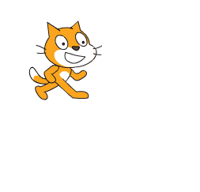

# CS Unplugged Activity Plan
#### by MiddleSchool_i_sHell
Roster: Saranii Muller, Patti Elfers Wygand, Adam Driggers, Greg Sciame

# Looping Coding Blocks (Unplugged)

### Background
Programs often repeat certain movements numerous times. They often lead into conditional statements. Students will be able to create shortcuts for movements that will be repeated by creating a "loop/loops that lead into conditional statements."

### Participant pre-requisites
* Students will be able to make basic movements in a block coding program such as Scratch, Blockley, etc., for example: move, turn left or turn right, etc.
* Students need to know what a square is, 4 sides and 4 corners
  
### Scaffolding / Differentiation 
* [Coding block paper cut-outs](https://docs.google.com/presentation/d/1p8k-hpccm8BWcgpZ7JqmdsOWMrmxzUH9Afcr-bM48i0/edit#slide=id.p) will be given to groups as a manipulative.
* Get students to demonstrate how to use code blocks to draw a square (don't pass out the paper loop blocks yet)
* THEN, discuss with the class how a loop can simplify the code for drawing a square (one loop, two blocks inside)
* Some students might only finish the first loop activity
* Other shapes - Draw a pentagon, hexagon, decagon

### Go!
1. Pass out more paper block cut-outs, including the loop blocks and a few other not technically necessary blocks
1. The goal is to have the students use the fewest amount of blocks needed.  (3)  
1. Students demonstrate their work.
1.  Why are loops important in coding?
2.  Challenge:  Create other shapes using loops.
   

### Related resources
* [Coding block paper cut-outs](https://docs.google.com/presentation/d/1p8k-hpccm8BWcgpZ7JqmdsOWMrmxzUH9Afcr-bM48i0/edit#slide=id.p)
  
* * *

Done already? Looking to be xtra? (this is entirely optional... only if you see a place where an image could help in a big way, and you have some time to noodle with your markdown)

A not-too-bad how-to guide for inserting images in your markdown: https://www.foxinfotech.in/2019/12/github-markdown-add-an-image-to-readme-md-file.html

